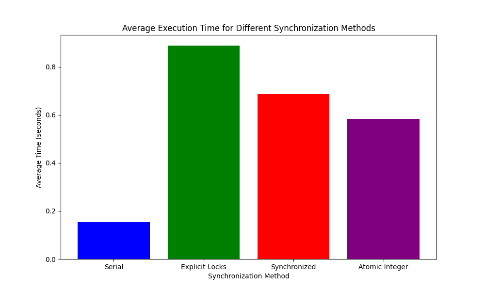

# Non-Parallelizable Java Threading

> In this experiment, I wanted to demonstrate how Java threading solutions scale when a task is not parallelizable. In particular, I tested 3 threading solutions against a serial execution: 
> 1. `ExplicitLock`
> 2. `synchronized`
> 3. `AtomicInteger`

The average execution time of each solution (outliers removed) is shown below:

As expected, the serial execution is the fastest. Because of the high contention for the single shared resource, all the concurrent solutions will introduce some form of overhead with thread context switching, whereas the serial execution will not need to do this.

## Results and Observations 

The experiment's findings are quite revealing. `ExplicitLock` was the slowest, with a significant margin. This underscores the cost associated with locks - they require the most overhead and are most affected by thread contention, making them suboptimal for tasks such as ours.

The `synchronized` block fared better than explicit locks, but still lagged behind the `AtomicInteger`. This can be attributed to the intrinsic costs of lock management in Java, which, while optimized within the `synchronized` context, still cannot match the lightweight nature of atomic operations.

`AtomicInteger` came closest to serial execution times among the threading solutions. Atomic operations provide a form of lock-free synchronization which is less costly than locks and `synchronized` blocks, hence their better performance. However, even this couldn't outperform the simplicity and directness of serial execution, which, without any concurrency overhead, led the pack.

It's clear from these results that when a task is inherently sequential, introducing threads does not aid performance. On the contrary, the overhead of managing the concurrent access can become a bottleneck. This experiment serves as a testament to the fact that not all tasks are suited for parallel execution and that threading models should be chosen based on the specific requirements and characteristics of the task at hand.